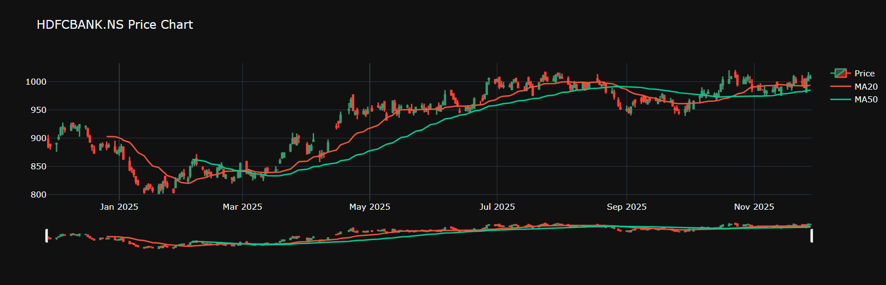
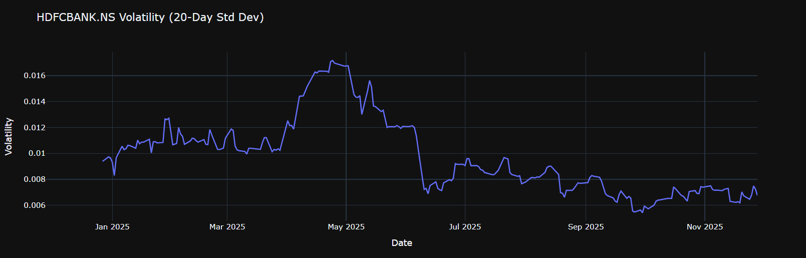

# 📊 Stock Market Dashboard (Python + Plotly Dash)

A simple and interactive stock market dashboard built using **Python, Pandas, Yahoo Finance, and Plotly Dash**.  
This dashboard includes:

- ✔ Candlestick Price Chart (with MA20 & MA50)
- ✔ Volatility Chart (20-day rolling standard deviation)

It helps visualize price movements, trends, and market volatility for any selected stock.

---

## 📌 Features

### 📈 Price Chart (Candlestick)
- OHLC candlestick visualization  
- 20-day Moving Average (MA20)  
- 50-day Moving Average (MA50)  
- Fully interactive (zoom, hover, pan)

### 📉 Volatility Chart
- 20-day rolling volatility  
- Simple risk visualization  
- Clean and interactive line chart

---

## 🖼️ Screenshots

### Price Chart  


---

### Volatility Chart  


---

## ⚙️ Setup Instructions

### 1️⃣ Clone the Repository
```bash
git clone https://github.com/SilK07/stock-market-dashboard.git
cd stock-market-dashboard
```

### 2️⃣ Create a Virtual Environment
```bash
python -m venv venv
```

### 3️⃣ Activate the Environment
```bash
venv\Scripts\activate
```

### 4️⃣ Install Dependencies
```bash
pip install -r requirements.txt
```

### 🚀 Start the Dashboard
```bash
python run.py
```

You will see:

📈 Price Chart (Candlestick + MA20 + MA50)

📉 Volatility Chart

Both update automatically when you select a different ticker.